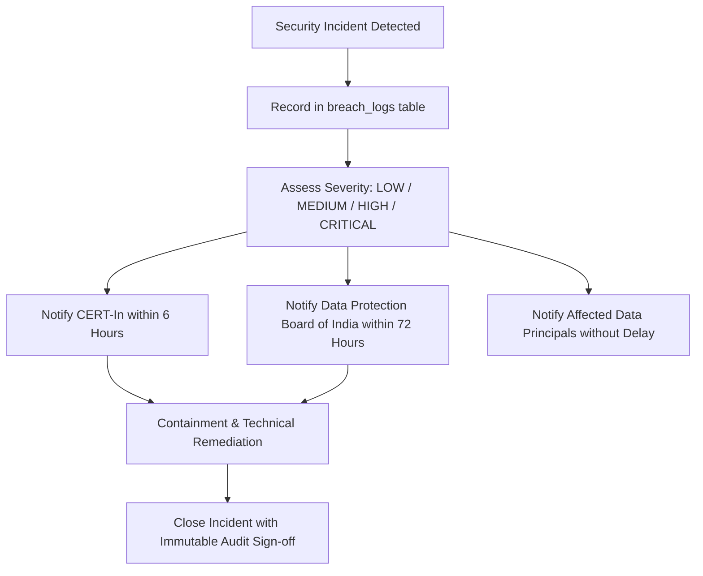

# DPDP Act 2023 & Statutory Regulatory Compliance Guide

## 1. Overview
The Digital Personal Data Protection (DPDP) Act, 2023 establishes comprehensive obligations for processing digital personal data within the Republic of India. Vericlaim SaaS is engineered to ensure subscribing insurance investigation agencies operate in full compliance with both the DPDP Act and prevailing Indian taxation statutes (CGST Act, 2017).

---

## 2. DPDP Act 2023 Compliance Matrix

| DPDP Section | Obligation | Vericlaim Architectural Implementation |
|---|---|---|
| **Section 6** | Explicit, purpose-specific consent | Table `consent_records` captures digital, physical, or audio consent linked to case IDs and documents. |
| **Section 6(4)** | Right to withdraw consent | `ComplianceService.withdrawConsent()` transitions status to `WITHDRAWN` and audits event in `audit_logs`. |
| **Section 8(5)** | Purpose limitation & erasure upon fulfillment | Retention engine identifies closed cases past statutory limitation periods for archival/anonymization. |
| **Section 8(6)** | Data breach notification to Board & principals | Table `breach_logs` tracks security incidents with automated flags for CERT-In (6h) and DPB (72h) reporting. |
| **Section 9** | Processing of children's data | Pediatric insurance claims enforce enhanced parental/guardian consent verification flags. |
| **Section 12** | Right to correction and erasure | Table `data_deletion_requests` tracks formal erasure requests with legal override evaluation. |
| **Section 17** | Exemptions for legal compliance & litigation | Erasure requests for active tax invoices, audit logs, or cases under insurance fraud investigation are rejected with statutory citations. |

---

## 3. Statutory Retention Schedule (Taxation vs. Claim Files)

### 3.1 8-Year Mandatory GST Retention (CGST Act Section 36)
- **Statutory Rule:** Section 36 of the Central Goods and Services Tax (CGST) Act, 2017 mandates that every registered taxable person retain books of account and tax records until the expiry of **72 months (6 years)** from the due date of filing the relevant annual return. To accommodate delayed return assessments, Vericlaim enforces an authoritative **8-year (96-month)** retention period for:
  - Issued Tax Invoices (`invoices`)
  - Credit Notes and Debit Notes (`invoice_credit_notes`)
  - Client Payment Ledgers and TDS Withholding Records (`client_payments`, `payment_allocations`)
- **Automated Override:** Invoices and payment ledgers CANNOT be deleted or purged prior to 96 months. Any data principal erasure request targeting billing records is systematically rejected under Section 17(1)(b) of the DPDP Act.

### 3.2 Investigation Case Files & Evidence
- Retained for **5 years** post case closure to support insurance repudiation litigation in consumer commissions or civil courts.
- Upon expiry of 5 years, cases transition to `ARCHIVED` status with automated PII pseudonymization.

---

## 4. Technical Safeguards & Column-Level Encryption (Rule A7)

1. **At-Rest & In-Transit Encryption:**
   - Database connections enforce TLS 1.3.
   - Cloudflare R2 evidence storage enforces AES-256 server-side encryption.
2. **Column-Level Encryption & Masking:**
   - Insured government identifiers (Aadhaar, PAN, Passport numbers) and claimant telephone numbers are encrypted at rest using AES-GCM-256.
   - Default views mask identifiers (e.g. `XXXX-XXXX-1234`). Every &quot;Reveal PII&quot; action generates an immutable audit entry in `audit_logs`.
3. **HMAC Blind Indexing:**
   - Plaintext PII is never indexed in searchable database columns.
   - Deterministic HMAC-SHA256 blind indexing (`computeBlindIndex`) enables exact-match search lookups without exposing sensitive data to SQL index scanners.
4. **Zero App Server File Streaming (Rule A8):**
   - Media bytes (photos, video evidence) are uploaded directly from client devices to Cloudflare R2 via pre-signed URLs. No PII media files transit through or reside on serverless application servers.

---

## 5. Security Incident & Breach Notification Procedure

In accordance with CERT-In Directive No. 20(3)/2022-CERT-In and DPDP Act Section 8(6):

