# Entity Relationship Diagram & Data Architecture (ERD)

## Overview
Vericlaim is a strictly isolated multi-tenant system. Every business entity contains `agency_id NOT NULL` with foreign key referencing `agencies(id)`, enforced via PostgreSQL Row-Level Security (RLS). Super-admin operations reside in isolated `platform_*` tables.

---

## 1. Mermaid Entity-Relationship Diagram

```mermaid
erDiagram
    PLATFORM_ADMINS {
        uuid id PK
        string email UK
        string full_name
        timestamptz created_at
    }

    AGENCIES {
        uuid id PK
        string code UK
        string name
        string slug UK
        string gstin
        string state_code
        text address
        string phone
        string email
        string logo_r2_key
        boolean is_active
        timestamptz created_at
        timestamptz updated_at
    }

    PLANS {
        uuid id PK
        string name UK
        string tier
        integer max_users
        integer max_cases_per_month
        boolean show_branding_footer
        timestamptz created_at
    }

    AGENCY_SUBSCRIPTIONS {
        uuid id PK
        uuid agency_id FK
        uuid plan_id FK
        string status
        date current_period_start
        date current_period_end
        timestamptz created_at
    }

    USERS {
        uuid id PK
        uuid agency_id FK
        string synthetic_auth_email UK
        string username
        string full_name
        string phone
        uuid reports_to_id FK
        boolean is_active
        timestamptz created_at
        timestamptz updated_at
    }

    ROLES {
        uuid id PK
        uuid agency_id FK
        string name
        string description
        string default_scope
        boolean is_system_template
        timestamptz created_at
    }

    PERMISSIONS {
        string id PK
        string module
        string name
        string description
    }

    ROLE_PERMISSIONS {
        uuid role_id FK
        string permission_id FK
    }

    USER_PERMISSIONS {
        uuid id PK
        uuid user_id FK
        string permission_id FK
        string effect
        uuid granted_by FK
        timestamptz granted_at
    }

    CLIENTS {
        uuid id PK
        uuid agency_id FK
        string name
        string code
        boolean is_active
        timestamptz created_at
    }

    CLIENT_BRANCHES {
        uuid id PK
        uuid agency_id FK
        uuid client_id FK
        string branch_name
        string legal_name
        string gstin
        string state
        string state_code
        text billing_address
        boolean is_default
        timestamptz created_at
    }

    CASE_TYPES {
        uuid id PK
        uuid agency_id FK
        string code
        string name
        integer default_sla_hours
        timestamptz created_at
    }

    MANAGER_SCOPES {
        uuid id PK
        uuid agency_id FK
        uuid manager_id FK
        uuid client_id FK
        uuid case_type_id FK
        boolean is_default
        timestamptz created_at
    }

    HOSPITALS {
        uuid id PK
        uuid agency_id FK
        string name
        string city
        string state
        string location_address
        numeric latitude
        numeric longitude
        integer risk_score
        boolean is_high_risk
        timestamptz created_at
    }

    INVESTIGATORS {
        uuid id PK
        uuid agency_id FK
        uuid user_id FK
        string full_name
        string phone
        string email
        string city
        string state
        string pincode
        string availability
        timestamptz deleted_at
        timestamptz created_at
    }

    INVESTIGATOR_PAYMENT_TERMS {
        uuid id PK
        uuid agency_id FK
        uuid investigator_id FK
        string payment_type
        numeric base_salary
        numeric default_fee_rate
        date effective_from
        date effective_to
        uuid created_by FK
        timestamptz created_at
    }

    CASES {
        uuid id PK
        uuid agency_id FK
        string doc_code
        date allocated_date
        uuid client_id FK
        uuid case_type_id FK
        string claim_no
        string policy_no
        string insured_name
        uuid hospital_id FK
        string location
        string status
        string outcome
        string fraud_reason
        string risk_level
        integer sla_hours
        timestamptz due_date
        timestamptz completed_at
        string exception_type
        text exception_reason
        timestamptz exception_at
        uuid exception_by_id FK
        uuid owner_manager_id FK
        uuid data_entry_user_id FK
        numeric total_investigator_cost
        integer rework_count
        integer version
        timestamptz deleted_at
        timestamptz created_at
        timestamptz updated_at
    }

    CASE_STATUS_HISTORY {
        uuid id PK
        uuid agency_id FK
        uuid case_id FK
        string from_status
        string to_status
        text reason
        uuid changed_by FK
        jsonb metadata
        timestamptz created_at
    }

    CASE_INVESTIGATORS {
        uuid id PK
        uuid agency_id FK
        uuid case_id FK
        uuid investigator_id FK
        uuid assigned_by FK
        string assignment_scope
        numeric agreed_fee
        numeric travel_allowance
        string payout_status
        string hardcopy_status
        uuid payout_id FK
        integer version
        timestamptz assigned_at
    }

    INVESTIGATOR_EXPENSES {
        uuid id PK
        uuid agency_id FK
        uuid case_id FK
        uuid investigator_id FK
        string category
        numeric requested_amount
        numeric approved_amount
        numeric distance_km
        text reason
        string status
        uuid approved_by FK
        timestamptz approved_at
        text admin_remarks
        uuid payout_id FK
        timestamptz created_at
    }

    INVESTIGATOR_PAYOUTS {
        uuid id PK
        uuid agency_id FK
        uuid investigator_id FK
        string month_code
        date payout_date
        numeric total_cases
        numeric gross_fees
        numeric gross_ta
        numeric expenses_amount
        numeric gross_total
        numeric taxable_base
        string tds_section
        numeric tds_rate
        numeric tds_amount
        numeric net_disbursable
        string status
        string payment_mode
        string reference_no
        uuid batch_id FK
        integer version
        timestamptz created_at
    }

    DOCUMENTS {
        uuid id PK
        uuid agency_id FK
        uuid case_id FK
        uuid uploaded_by FK
        string storage_key
        string file_name
        bigint file_size
        string mime_type
        string sha256_hash
        string status
        numeric claimed_latitude
        numeric claimed_longitude
        timestamptz claimed_captured_at
        timestamptz verified_at
        timestamptz created_at
    }

    REPORT_VERSIONS {
        uuid id PK
        uuid agency_id FK
        uuid case_id FK
        integer version_number
        uuid author_id FK
        string status
        jsonb content
        string pdf_r2_key
        string pdf_sha256
        timestamptz created_at
    }

    COURIER_DOCKETS {
        uuid id PK
        uuid agency_id FK
        string docket_number
        uuid client_id FK
        string courier_partner
        string awb_number
        timestamptz dispatched_at
        uuid dispatched_by FK
        string manifest_pdf_r2_key
        string manifest_pdf_sha256
        timestamptz created_at
    }

    HARDCOPY_MOVEMENTS {
        uuid id PK
        uuid agency_id FK
        uuid case_id FK
        string movement_type
        string from_location
        string to_location
        uuid handler_id FK
        uuid docket_id FK
        text notes
        timestamptz moved_at
    }

    INVOICES {
        uuid id PK
        uuid agency_id FK
        uuid client_id FK
        uuid client_branch_id FK
        string financial_year
        integer sequence_number
        string invoice_number UK
        string status
        date invoice_date
        numeric taxable_amount
        numeric cgst_rate
        numeric cgst_amount
        numeric sgst_rate
        numeric sgst_amount
        numeric igst_rate
        numeric igst_amount
        numeric total_amount
        string pdf_r2_key
        string pdf_sha256
        string irn_stub
        integer version
        uuid issued_by FK
        timestamptz issued_at
    }

    INVOICE_ITEMS {
        uuid id PK
        uuid invoice_id FK
        uuid case_id FK
        text description
        numeric fee_amount
        numeric expense_amount
        numeric taxable_amount
    }

    CREDIT_NOTES {
        uuid id PK
        uuid agency_id FK
        uuid invoice_id FK
        string financial_year
        integer sequence_number
        string credit_note_number UK
        text reason
        numeric taxable_amount
        numeric cgst_amount
        numeric sgst_amount
        numeric igst_amount
        numeric total_amount
        string pdf_r2_key
        string pdf_sha256
        uuid created_by FK
        timestamptz created_at
    }

    CLIENT_PAYMENTS {
        uuid id PK
        uuid agency_id FK
        uuid invoice_id FK
        uuid client_id FK
        date payment_date
        numeric amount_received
        numeric tds_deducted
        string tds_section
        string bank_reference
        string idempotency_key UK
        uuid recorded_by FK
        timestamptz created_at
    }

    TDS_RECONCILIATIONS {
        uuid id PK
        uuid agency_id FK
        uuid client_id FK
        string financial_year
        numeric tds_26as_amount
        numeric tds_ledger_amount
        string acknowledgment_no
        string match_status
        uuid verified_by FK
        timestamptz verified_at
    }

    AUDIT_LOGS {
        uuid id PK
        uuid agency_id FK
        uuid user_id FK
        string action
        string entity_type
        uuid entity_id
        jsonb old_values
        jsonb new_values
        string ip_address
        string user_agent
        timestamptz created_at
    }

    IMPORT_BATCHES {
        uuid id PK
        uuid agency_id FK
        uuid imported_by FK
        string file_name
        integer total_rows
        integer inserted_count
        integer updated_count
        integer failed_count
        boolean rollback_available
        timestamptz rolled_back_at
        uuid rolled_back_by FK
        timestamptz created_at
    }

    AGENCIES ||--o{ USERS : "has"
    AGENCIES ||--o{ ROLES : "defines"
    AGENCIES ||--o{ CLIENTS : "serves"
    AGENCIES ||--o{ CASE_TYPES : "configures"
    AGENCIES ||--o{ CASES : "manages"
    AGENCIES ||--o{ INVOICES : "issues"
    AGENCIES ||--o{ INVESTIGATORS : "employs"
    AGENCIES ||--o{ IMPORT_BATCHES : "imports"
    AGENCIES ||--o{ AUDIT_LOGS : "logs"

    USERS ||--o{ USERS : "reports_to"
    USERS ||--o{ USER_PERMISSIONS : "holds"
    USERS ||--o{ MANAGER_SCOPES : "owns_scope"

    CLIENTS ||--o{ CLIENT_BRANCHES : "has_branches"
    CLIENTS ||--o{ CASES : "allocates"
    CLIENTS ||--o{ INVOICES : "billed"

    CASES ||--o{ CASE_STATUS_HISTORY : "status_log"
    CASES ||--o{ CASE_INVESTIGATORS : "assigned_investigators"
    CASES ||--o{ DOCUMENTS : "evidence"
    CASES ||--o{ REPORT_VERSIONS : "reports"
    CASES ||--o{ HARDCOPY_MOVEMENTS : "physical_tracking"
    CASES ||--o{ INVOICE_ITEMS : "billed_in"

    INVESTIGATORS ||--o{ INVESTIGATOR_PAYMENT_TERMS : "terms"
    INVESTIGATORS ||--o{ CASE_INVESTIGATORS : "works_on"
    INVESTIGATORS ||--o{ INVESTIGATOR_EXPENSES : "claims"
    INVESTIGATORS ||--o{ INVESTIGATOR_PAYOUTS : "receives"

    INVOICES ||--o{ INVOICE_ITEMS : "contains"
    INVOICES ||--o{ CREDIT_NOTES : "adjusted_by"
    INVOICES ||--o{ CLIENT_PAYMENTS : "paid_by"
```

---

## 2. Platform & Multi-Tenant Entities Specification

### 2.1 `platform_admins`
Dedicated super-admin table completely isolated from tenant rows.
- `id` (uuid, PK, gen_random_uuid())
- `email` (text, UNIQUE, NOT NULL)
- `full_name` (text, NOT NULL)
- `created_at` (timestamptz, DEFAULT now())

### 2.2 `agencies` (Tenants)
- `id` (uuid, PK, gen_random_uuid())
- `code` (varchar(16), UNIQUE, NOT NULL): Human agency code entered on login (e.g. `'DNA'`, `'ALPHA'`).
- `name` (text, NOT NULL): Legal agency name.
- `slug` (varchar(64), UNIQUE, NOT NULL).
- `gstin` (varchar(15), NULL): 15-character statutory GSTIN.
- `state_code` (varchar(2), NOT NULL): Two-digit state code (e.g. `'23'`).
- `address` (text, NOT NULL)
- `phone` (text), `email` (text)
- `logo_r2_key` (text, NULL)
- `is_active` (boolean, DEFAULT true)
- `created_at`, `updated_at` (timestamptz, DEFAULT now())

### 2.3 `plans` & `agency_subscriptions`
- `plans`: `id`, `name`, `tier` (`'free'`, `'starter'`, `'professional'`, `'enterprise'`), `max_users`, `max_cases_per_month`, `show_branding_footer` (boolean, DEFAULT true), `created_at`.
- `agency_subscriptions`: `id`, `agency_id` (FK), `plan_id` (FK), `status` (`'active'`, `'past_due'`, `'cancelled'`), `current_period_start`, `current_period_end`, `created_at`.

---

## 3. Users, Permissions & Scopes Specification

### 3.1 `users`
- `id` (uuid, PK, gen_random_uuid())
- `agency_id` (uuid, NOT NULL, REFERENCES agencies(id) ON DELETE RESTRICT)
- `synthetic_auth_email` (text, UNIQUE, NOT NULL): Internal auth email format `u_<uuid>@auth.vericlaim.in`.
- `username` (varchar(64), NOT NULL): Unique per agency: `UNIQUE(agency_id, username)`.
- `full_name` (text, NOT NULL)
- `phone` (text, NULL)
- `reports_to_id` (uuid, NULL, REFERENCES users(id) ON DELETE SET NULL): Strict tree hierarchy (depth cap 5).
- `is_active` (boolean, DEFAULT true)
- `created_at`, `updated_at` (timestamptz, DEFAULT now())

### 3.2 `roles` & `role_permissions`
- `roles`: `id`, `agency_id` (FK), `name` (varchar(64)), `description` (text), `default_scope` (`'ALL'`, `'TEAM'`, `'ASSIGNED'`, `'OWN_ENTERED'`), `is_system_template` (boolean, DEFAULT false). Constraint: `UNIQUE(agency_id, name)`.
- `role_permissions`: `role_id` (FK), `permission_id` (varchar(64) REFERENCES permissions(id)). Primary key `(role_id, permission_id)`.

### 3.3 `user_permissions` (Granular User-Level Overrides)
- `id` (uuid, PK)
- `user_id` (uuid, NOT NULL, REFERENCES users(id) ON DELETE CASCADE)
- `permission_id` (varchar(64), NOT NULL, REFERENCES permissions(id))
- `effect` (varchar(8), NOT NULL, CHECK (effect IN ('ALLOW', 'DENY')))
- `granted_by` (uuid, REFERENCES users(id))
- `granted_at` (timestamptz, DEFAULT now())
- Constraint: `UNIQUE(user_id, permission_id)`

### 3.4 `manager_scopes`
- `id` (uuid, PK)
- `agency_id` (uuid, NOT NULL, REFERENCES agencies(id))
- `manager_id` (uuid, NOT NULL, REFERENCES users(id) ON DELETE CASCADE)
- `client_id` (uuid, NOT NULL, REFERENCES clients(id) ON DELETE CASCADE)
- `case_type_id` (uuid, NOT NULL, REFERENCES case_types(id) ON DELETE CASCADE)
- `is_default` (boolean, DEFAULT false)
- Constraint: `UNIQUE(agency_id, manager_id, client_id, case_type_id)`

---

## 4. Cases, Multi-Investigator & Workflow Specification

### 4.1 `cases`
- `id` (uuid, PK, gen_random_uuid())
- `agency_id` (uuid, NOT NULL, REFERENCES agencies(id))
- `doc_code` (varchar(32), NOT NULL): Sequential month code (e.g. `'OCT26-0001'`). Constraint: `UNIQUE(agency_id, doc_code)`.
- `allocated_date` (date, NOT NULL, DEFAULT CURRENT_DATE)
- `client_id` (uuid, NOT NULL, REFERENCES clients(id))
- `case_type_id` (uuid, NOT NULL, REFERENCES case_types(id))
- `claim_no` (varchar(128), NOT NULL): Constraint: `UNIQUE(agency_id, client_id, upper(btrim(claim_no))) WHERE deleted_at IS NULL`.
- `policy_no` (varchar(128), NULL)
- `insured_name` (varchar(255), NOT NULL)
- `hospital_id` (uuid, NULL, REFERENCES hospitals(id))
- `location` (varchar(255), NULL)
- `status` (varchar(32), NOT NULL, DEFAULT 'DATA_ENTRY')
- `outcome` (varchar(32), NOT NULL, DEFAULT 'PENDING'): Canonical outcome enum (`'PENDING'`, `'GENUINE'`, `'FRAUD'`, `'SUSPICIOUS'`, `'REPUDIATED'`, `'UNTRACEABLE'`).
- `fraud_reason` (text, NULL)
- `risk_level` (varchar(16), DEFAULT 'LOW', CHECK (risk_level IN ('LOW', 'MEDIUM', 'HIGH')))
- `sla_hours` (integer, NOT NULL, DEFAULT 24)
- `due_date` (timestamptz, NOT NULL)
- `completed_at` (timestamptz, NULL)
- `exception_type` (varchar(32), NULL, CHECK (exception_type IN ('WITHDRAWN', 'REJECTED')))
- `exception_reason` (text, NULL)
- `exception_at` (timestamptz, NULL)
- `exception_by_id` (uuid, NULL, REFERENCES users(id))
- `owner_manager_id` (uuid, NULL, REFERENCES users(id)): Null indicates "Unrouted Queue".
- `data_entry_user_id` (uuid, NOT NULL, REFERENCES users(id))
- `total_investigator_cost` (numeric(14,2), NOT NULL, DEFAULT 0.00)
- `rework_count` (integer, NOT NULL, DEFAULT 0)
- `version` (integer, NOT NULL, DEFAULT 1): Optimistic locking counter.
- `deleted_at`, `deleted_by`, `delete_reason` (soft-delete fields).
- `created_at`, `updated_at` (timestamptz, DEFAULT now())

### 4.2 `case_investigators` (Relational $N$ Operatives)
- `id` (uuid, PK, gen_random_uuid())
- `agency_id` (uuid, NOT NULL, REFERENCES agencies(id))
- `case_id` (uuid, NOT NULL, REFERENCES cases(id) ON DELETE CASCADE)
- `investigator_id` (uuid, NOT NULL, REFERENCES investigators(id) ON DELETE RESTRICT)
- `assigned_by` (uuid, NOT NULL, REFERENCES users(id))
- `assignment_scope` (varchar(64), DEFAULT 'PRIMARY_FIELD'): Scope of task (e.g. `'HOSPITAL_CHECK'`, `'INSURED_VERIFICATION'`, `'EMPLOYER_CHECK'`).
- `agreed_fee` (numeric(14,2), NOT NULL, DEFAULT 0.00)
- `travel_allowance` (numeric(14,2), NOT NULL, DEFAULT 0.00)
- `payout_status` (varchar(32), NOT NULL, DEFAULT 'PENDING', CHECK (payout_status IN ('PENDING', 'APPROVED', 'PAID', 'CANCELLED')))
- `hardcopy_status` (varchar(32), NOT NULL, DEFAULT 'PENDING', CHECK (hardcopy_status IN ('PENDING', 'RECEIVED', 'WAIVED')))
- `payout_id` (uuid, NULL, REFERENCES investigator_payouts(id))
- `version` (integer, NOT NULL, DEFAULT 1)
- `assigned_at` (timestamptz, DEFAULT now())
- Constraint: `UNIQUE(case_id, investigator_id)`

### 4.3 `investigator_payment_terms`
Effective-dated terms decoupling investigators from static payment types.
- `id` (uuid, PK)
- `agency_id` (uuid, NOT NULL, REFERENCES agencies(id))
- `investigator_id` (uuid, NOT NULL, REFERENCES investigators(id) ON DELETE CASCADE)
- `payment_type` (varchar(16), NOT NULL, CHECK (payment_type IN ('PER_CASE', 'SALARY')))
- `base_salary` (numeric(14,2), NOT NULL, DEFAULT 0.00)
- `default_fee_rate` (numeric(14,2), NOT NULL, DEFAULT 0.00)
- `effective_from` (date, NOT NULL)
- `effective_to` (date, NULL): NULL indicates currently active term.
- `created_by` (uuid, REFERENCES users(id))
- `created_at` (timestamptz, DEFAULT now())
- Index: `idx_inv_terms_range` on `(investigator_id, effective_from, effective_to)`.

---

## 5. Invoicing, Payments, TDS & Audit Specification

### 5.1 `invoices` & `invoice_items`
- `invoices`: `id`, `agency_id`, `client_id`, `client_branch_id`, `financial_year` (varchar(9), e.g. `'2026-2027'`), `sequence_number` (integer), `invoice_number` (varchar(64), `UNIQUE(agency_id, invoice_number)`), `status` (`'DRAFT'`, `'ISSUED'`, `'CANCELLED_BY_CREDIT_NOTE'`), `invoice_date` (date), `taxable_amount`, `cgst_rate`, `cgst_amount`, `sgst_rate`, `sgst_amount`, `igst_rate`, `igst_amount`, `total_amount` (numeric(14,2)), `pdf_r2_key`, `pdf_sha256` (char(64)), `irn_stub` (text), `version`, `issued_by`, `issued_at`.
- `invoice_items`: `id`, `invoice_id` (FK), `case_id` (FK), `description` (text), `fee_amount`, `expense_amount`, `taxable_amount`. Constraint: `UNIQUE(invoice_id, case_id)`.

### 5.2 `credit_notes`
- `id` (uuid, PK)
- `agency_id` (uuid, NOT NULL, REFERENCES agencies(id))
- `invoice_id` (uuid, NOT NULL, REFERENCES invoices(id))
- `financial_year` (varchar(9), NOT NULL)
- `sequence_number` (integer, NOT NULL)
- `credit_note_number` (varchar(64), NOT NULL): `UNIQUE(agency_id, credit_note_number)`.
- `reason` (text, NOT NULL)
- `taxable_amount`, `cgst_amount`, `sgst_amount`, `igst_amount`, `total_amount` (numeric(14,2))
- `pdf_r2_key`, `pdf_sha256` (char(64))
- `created_by` (uuid, REFERENCES users(id)), `created_at` (timestamptz)

### 5.3 `client_payments`
Append-only payment entries. Zero in-place updates.
- `id` (uuid, PK)
- `agency_id` (uuid, NOT NULL, REFERENCES agencies(id))
- `invoice_id` (uuid, NOT NULL, REFERENCES invoices(id))
- `client_id` (uuid, NOT NULL, REFERENCES clients(id))
- `payment_date` (date, NOT NULL)
- `amount_received` (numeric(14,2), NOT NULL, DEFAULT 0.00)
- `tds_deducted` (numeric(14,2), NOT NULL, DEFAULT 0.00)
- `tds_section` (varchar(32), NULL)
- `bank_reference` (varchar(128), NULL)
- `idempotency_key` (varchar(128), NOT NULL): `UNIQUE(agency_id, idempotency_key)`.
- `recorded_by` (uuid, REFERENCES users(id))
- `created_at` (timestamptz, DEFAULT now())

### 5.4 `import_batches`
- `id` (uuid, PK)
- `agency_id` (uuid, NOT NULL, REFERENCES agencies(id))
- `imported_by` (uuid, NOT NULL, REFERENCES users(id))
- `file_name` (text, NOT NULL)
- `total_rows`, `inserted_count`, `updated_count`, `failed_count` (integer)
- `rollback_available` (boolean, DEFAULT true)
- `rolled_back_at` (timestamptz, NULL)
- `rolled_back_by` (uuid, NULL, REFERENCES users(id))
- `created_at` (timestamptz, DEFAULT now())

### 5.5 `audit_logs`
Append-only immutable audit trail protected from UPDATE and DELETE.
- `id` (uuid, PK)
- `agency_id` (uuid, NOT NULL, REFERENCES agencies(id))
- `user_id` (uuid, NULL, REFERENCES users(id))
- `action` (varchar(64), NOT NULL)
- `entity_type` (varchar(64), NOT NULL)
- `entity_id` (uuid, NOT NULL)
- `old_values` (jsonb, NULL)
- `new_values` (jsonb, NULL)
- `ip_address` (inet, NULL)
- `user_agent` (text, NULL)
- `created_at` (timestamptz, NOT NULL, DEFAULT now())
