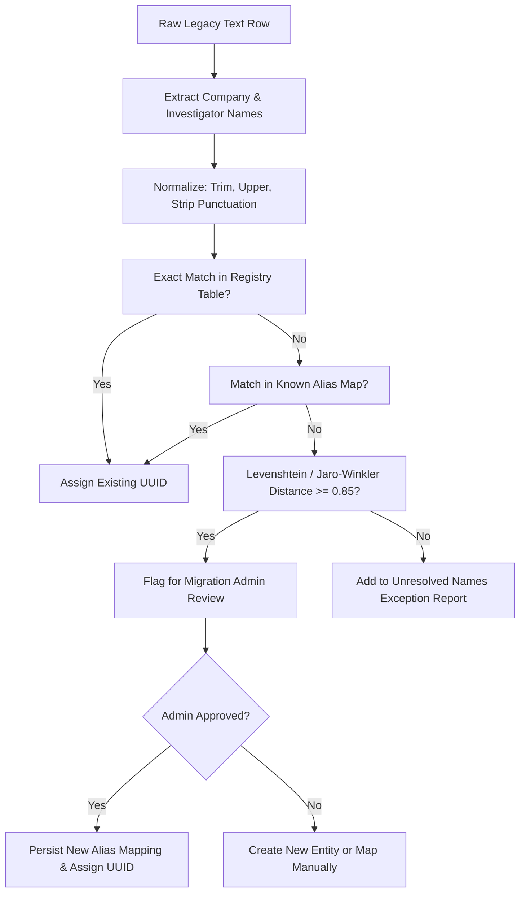

# Legacy to Multi-Tenant Data Mapping & Entity Resolution Plan

## Overview
The legacy DNA database (`cases`, `investigators`, `insurance_company_branches`, `investigator_payouts`, `investigator_expenses`) was a single-tenant design that referenced core business entities (Investigators, Insurance Companies, Branches) by raw text strings.

This document details:
1. Exact mapping from legacy flat columns to Vericlaim's normalized multi-tenant relational schema.
2. The entity resolution pipeline for translating names to immutable UUID foreign keys.
3. The format of the **Unresolved Names & Reconciliation Exception Report**.

---

## 1. Column-to-Entity Mapping

### 1.1 Legacy `cases` Table -> Vericlaim Target Entities

| Legacy `cases` Column | Vericlaim Target Entity & Field | Type | Transformation / Business Rule |
|---|---|---|---|
| `id` | `cases.legacy_id` | UUID | Preserved as migration metadata reference. |
| — | `cases.agency_id` | UUID NOT NULL | Populated with DNA Professional Agency UUID (`tenant_1`). |
| `doc_code` | `cases.doc_code` | VARCHAR(32) NOT NULL | Unique per agency: `UNIQUE(agency_id, doc_code)`. |
| `date` | `cases.allocated_at` | TIMESTAMPTZ | Converted to UTC timestamptz. |
| `received_date` | `client_payments.payment_date` | DATE | Moved to append-only client payment ledger. |
| `company` | `cases.client_id` | UUID NOT NULL | Resolved via Entity Resolution Pipeline from company text to `clients.id`. |
| `case_type` | `cases.case_type_id` | UUID NOT NULL | Resolved to `agency_case_types.id`. Standardized (e.g. 'CASHLESS', 'REIMBURSEMENT'). |
| `claim_no` | `cases.claim_no` | VARCHAR(128) NOT NULL | Enforced unique per agency & client: `UNIQUE(agency_id, client_id, claim_no)`. |
| `policy_no` | `cases.policy_no` | VARCHAR(128) | Trimmed text. |
| `insured_name` | `cases.insured_name` | VARCHAR(255) NOT NULL | Masked in standard views; reveal audited under DPDP Act. |
| `hospital` | `cases.hospital_id` | UUID | Resolved to `hospitals.id` (or creates new hospital record). |
| `location` | `cases.location` | VARCHAR(255) | Trimmed text. |
| `inv1`, `inv2` | `case_investigators` (N rows) | N rows | Each assigned investigator becomes a row in `case_investigators` linking `case_id` and `investigator_id` (UUID). |
| `fee1`, `fee2` | `case_investigators.agreed_fee` | NUMERIC(14,2) | Mapped to investigator assignment record. |
| `ta1`, `ta2` | `case_investigators.travel_allowance` | NUMERIC(14,2) | Mapped to investigator assignment record. |
| `inv1_status`, `inv2_status` | `case_investigators.payout_status` | VARCHAR(32) | `'Pending'`, `'Paid'`. |
| `total_payable` | `cases.total_investigator_cost` | NUMERIC(14,2) | Sum of active `case_investigators` payable amounts. |
| `invoice_no` | `invoices.invoice_number` | VARCHAR(64) | Linked via `case_invoices` junction table. |
| `invoice_amount` | `invoices.grand_total` | NUMERIC(14,2) | Mapped to immutable invoice header. |
| `received` | `client_payments.amount` | NUMERIC(14,2) | First payment entry in `client_payments`. |
| `tds_deducted` | `client_payments.tds_deducted` | NUMERIC(14,2) | Statutory client withholding tax. |
| `profit` | *Deprecated / Computed View* | NUMERIC(14,2) | Computed cleanly as `Taxable Revenue - Investigator Costs`. |
| `hardcopy1_status`, `hardcopy2_status` | `case_investigators.hardcopy_status` | VARCHAR(32) | Individual hardcopy status per assigned investigator. |
| `hardcopy_receive_date` | `hardcopy_movements.received_at` | TIMESTAMPTZ | Audit movement entry. |
| `company_hardcopy_status` | `cases.client_dispatch_status` | VARCHAR(32) | `'Pending'`, `'Dispatched'`. |
| `company_hardcopy_awb` | `courier_dockets.awb_number` | VARCHAR(128) | Mapped to courier dispatch docket. |
| `company_dispatch_date` | `courier_dockets.dispatched_at` | TIMESTAMPTZ | Docket dispatch timestamp. |
| `outcome` | `cases.outcome` | VARCHAR(64) | Normalized to canonical enum: `'Pending'`, `'Genuine'`, `'Fraud'`, `'Suspicious'`, `'Repudiated'`, `'Untraceable'`, `'Settled'`. |
| `sla_hours` | `cases.sla_hours` | INTEGER | Default `24` if empty. |
| `due_date` | `cases.sla_due_date` | TIMESTAMPTZ | Authoritative SLA deadline. |
| `completed_at` | `cases.completed_at` | TIMESTAMPTZ | Closure timestamp. |
| `risk_level` | `cases.risk_level` | VARCHAR(32) | `'Low'`, `'Medium'`, `'High'`. |
| `exception_type` | `cases.exception_type` | VARCHAR(32) | `'Withdrawn'`, `'Rejected'`, null. |
| `exception_reason` | `cases.exception_reason` | TEXT | Exception narrative. |
| `exception_at` | `cases.exception_at` | TIMESTAMPTZ | Timestamp exception logged. |
| `exception_by` | `cases.exception_by_user_id` | UUID | User UUID. |
| `custom_data` | `case_custom_values` | EAV / JSONB | Key-value custom fields mapped to agency custom field definitions. |
| `custom_data.ta_request` | `investigator_ta_requests` | Row | Extracted from JSONB into dedicated approval workflow table. |

---

### 1.2 Legacy `investigators` Table -> Vericlaim Target Entities

| Legacy Column | Vericlaim Target Column | Notes |
|---|---|---|
| `id` | `investigators.id` | Preserved UUID primary key. |
| — | `investigators.agency_id` | `tenant_1` UUID. |
| `name` | `investigators.full_name` | Canonical title-cased name. |
| `phone`, `email` | `investigators.phone`, `email` | Unique per agency. |
| `payment_type` | `investigator_payment_terms.payment_type` | `'Per Case'` or `'Salary'`. |
| `salary_amount` | `investigator_payment_terms.base_salary` | Effective-dated salary term. |
| `payment_type_changed_at` | `investigator_payment_terms.effective_from` | Effective start date of compensation terms. |
| `removed` | `investigators.deleted_at` | Soft delete support. |

---

## 2. Entity Resolution Plan (Text to Immutable UUIDs)

Legacy data contains spelling inconsistencies, casing variations, nicknames, and branch suffixes (e.g. `"Anil rajput kanod"` vs `"Anil Rajput"`, `"TATA AIG"` vs `"Tata AIG General Insurance"`, `"CARE"` vs `"Care Health"`).

### Resolution Pipeline Architecture


### Pre-Seeded Canonical Alias Dictionaries
```typescript
export const KNOWN_COMPANY_ALIASES: Record<string, string> = {
  'STAR': 'STAR HEALTH',
  'STAR HEALTH AND ALLIED': 'STAR HEALTH',
  'CARE HEALTH': 'CARE',
  'RELIGARE': 'CARE',
  'SBI GENERAL': 'SBI',
  'TATA AIA LIFE': 'TATA AIA',
  'TATA AIG GENERAL': 'TATA AIG',
  'ADITYA BIRLA HEALTH': 'ADITYA BIRLA',
  'IFFCO-TOKIO': 'IFFCO TOKIO',
  'CHOLAMANDALAM': 'CHOLA',
  'VIDAL': 'VIDAL HEALTH',
  'BRAIN BIRD': 'BRAINBIRD'
};

export const KNOWN_INVESTIGATOR_NORMALIZATION: Record<string, string> = {
  'ANIL RAJPUT KANOD': 'Anil Rajput',
  'ARUN BARFA': 'Arun Barfa',
  'DHEERAJ JAGADHALE': 'Dheeraj Jagadhale',
  'PAVAN PRAJAPATI': 'Pavan Prajapati',
  'NA': '__UNASSIGNED__',
  'DNA': '__INTERNAL_DNA__'
};
```

---

## 3. Unresolved Names & Reconciliation Exception Report Format

During the Phase 10 migration execution, the migration tool generates an interactive reconciliation CSV/JSON report before committing changes.

### Schema of Exception Report (`docs/UNRESOLVED_ENTITIES_SAMPLE.json`)
```json
{
  "agency_id": "00000000-0000-0000-0000-000000000001",
  "batch_id": "mig_batch_20261002_001",
  "generated_at": "2026-10-02T20:55:00.000Z",
  "summary": {
    "total_cases_analyzed": 5420,
    "company_names_matched_exact": 5310,
    "company_names_fuzzy_flagged": 85,
    "company_names_unresolved": 25,
    "investigator_names_matched_exact": 4900,
    "investigator_names_fuzzy_flagged": 380,
    "investigator_names_unresolved": 140
  },
  "exceptions": [
    {
      "exception_id": "EXC-001",
      "entity_type": "investigator",
      "legacy_field": "inv1",
      "raw_text": "Anil Rajput (Dewas)",
      "occurrences": 14,
      "suggested_match": {
        "entity_id": "inv_uuid_7718",
        "canonical_name": "Anil Rajput",
        "similarity_score": 0.89
      },
      "affected_doc_codes": ["JUL26-0112", "JUL26-0418", "AUG26-0901"],
      "resolution_status": "pending_admin_action"
    },
    {
      "exception_id": "EXC-002",
      "entity_type": "company",
      "legacy_field": "company",
      "raw_text": "FUTURE GENERALI TPA",
      "occurrences": 6,
      "suggested_match": {
        "entity_id": null,
        "canonical_name": null,
        "similarity_score": 0.42
      },
      "affected_doc_codes": ["JUN26-0312", "JUN26-0315"],
      "resolution_status": "unresolved_new_entity_required"
    }
  ]
}
```

### Migration Safety Rules
1. **Zero Silent Fallbacks:** No case may be mapped to a default ID or random investigator if unresolved. Unresolved cases are halted in the staging table.
2. **Preview Diff Before Commit:** The user/admin views the full side-by-side diff before running the batch commit.
3. **One-Click Batch Rollback:** Every migration run records an `import_batch_id`. If any structural corruption is detected, `rollbackBatch(import_batch_id)` completely deletes the migrated batch and restores previous state cleanly.
