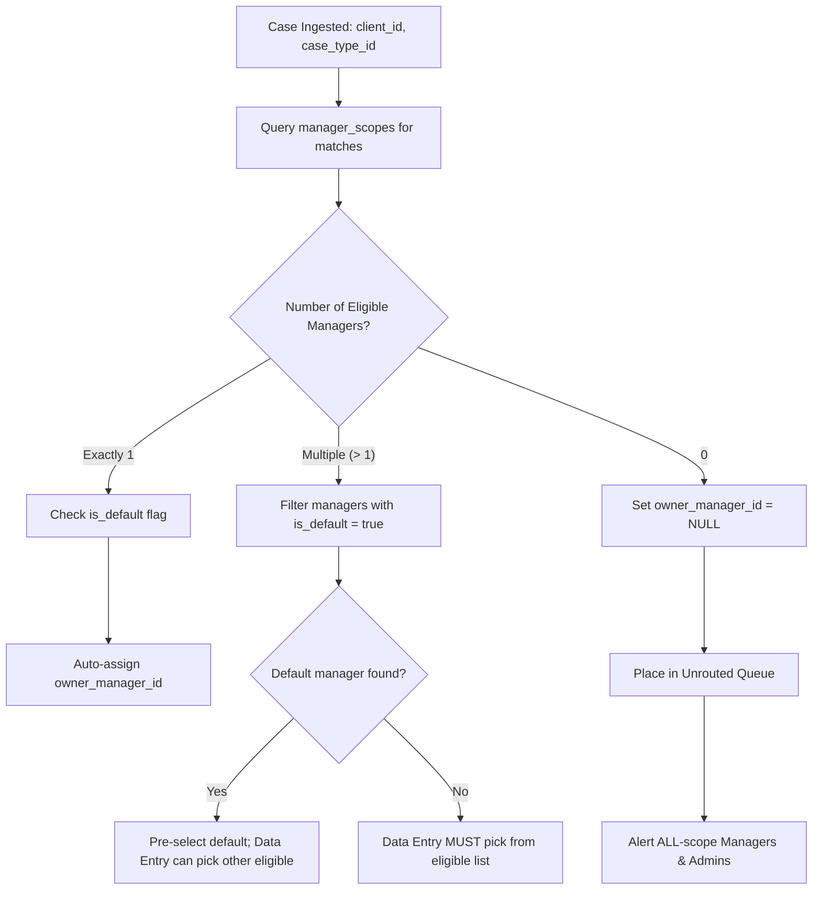
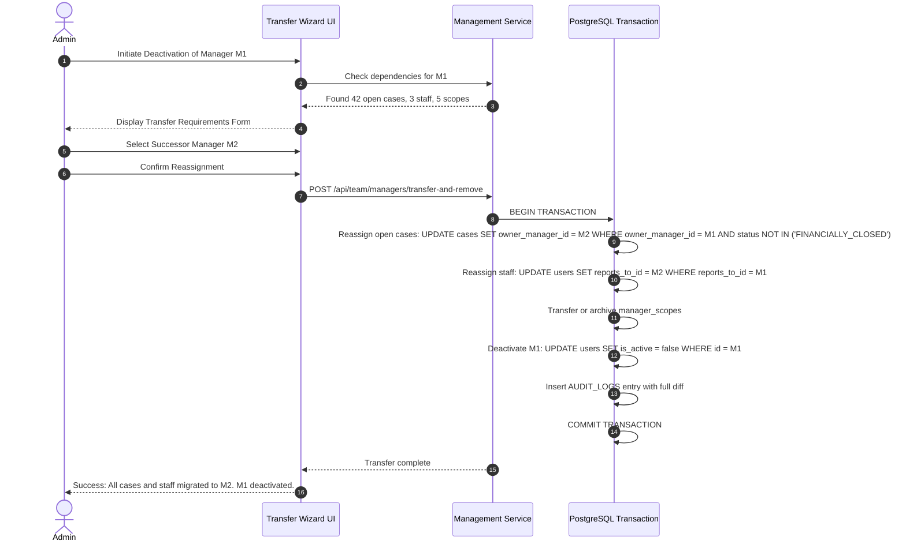

# Case Ownership, Routing Engine & Subtree Scope Architecture

## 1. Case Ownership Fundamentals

In Vericlaim, every case has:
1. `agency_id`: Tenant boundary.
2. `owner_manager_id`: Exactly one responsible manager who oversees field operations, holds assignment authority, and tracks TAT.
3. `data_entry_user_id`: The staff member who originally ingested the claim intimation.

---

## 2. Dynamic Routing Engine: `(client, case_type)` to Manager

### 2.1 The Problem
In an investigation agency, different managers specialize in specific insurance clients (e.g. Star Health, SBI General) or specific claim disciplines (e.g. Cashless hospitalization, PA accident reconstruction, Spot investigation). Multiple managers may handle the same combination in large agencies.

### 2.2 Routing Resolution Algorithm
When a case is created or imported:


### 2.3 Data Entry Routing Rules
1. **Single Match:** If exactly one manager holds the `(client, case_type)` combination, they are automatically assigned as `owner_manager_id`.
2. **Multiple Matches with Default:** If multiple managers match, the one with `is_default = true` is pre-selected; Data Entry can choose another eligible manager from a filtered dropdown.
3. **Multiple Matches without Default:** Data Entry is blocked from submitting until they explicitly select one eligible manager.
4. **Zero Match (Unrouted Queue):** If no manager has registered scopes for the combination, `owner_manager_id` is set to `NULL`. The case enters the **Unrouted Queue**, visible strictly to roles with `ALL` scope (Owner, Admin). Any admin can manually assign an owner manager, which automatically updates or creates a routing rule.

---

## 3. Team Subtree Hierarchy & Depth Cap

### 3.1 Structure
- Staff have exactly one `reports_to_id` referencing a manager.
- Managers may report to higher-level Senior Managers or Agency Owners.
- A user with scope `TEAM` can see:
  - If the user is staff: Cases owned by their direct `reports_to` manager.
  - If the user is a manager: Cases owned by themselves, plus all cases owned by managers in their subordinate subtree.

### 3.2 Maximum Depth Cap: 5 Levels
To ensure high-performance SQL traversal and prevent recursive graph loops, the hierarchy enforces a strict **depth cap of 5 levels**:
$$\text{Level 1 (Owner)} \rightarrow \text{Level 2 (General Manager)} \rightarrow \text{Level 3 (Regional Manager)} \rightarrow \text{Level 4 (Case Manager)} \rightarrow \text{Level 5 (Field/Staff)}$$

### 3.3 Subtree Cycle & Depth Prevention Trigger
```sql
CREATE OR REPLACE FUNCTION public.check_user_subtree_depth()
RETURNS trigger
LANGUAGE plpgsql
AS $$
DECLARE
  v_depth integer := 0;
  v_cur uuid := NEW.reports_to_id;
BEGIN
  IF NEW.reports_to_id IS NULL THEN
    RETURN NEW;
  END IF;

  -- Disallow self-reporting
  IF NEW.id = NEW.reports_to_id THEN
    RAISE EXCEPTION 'A user cannot report to themselves.';
  END IF;

  -- Traverse up to verify maximum depth and cycle detection
  WHILE v_cur IS NOT NULL LOOP
    v_depth := v_depth + 1;
    IF v_depth > 5 THEN
      RAISE EXCEPTION 'Reporting hierarchy exceeds maximum depth limit of 5 levels.';
    END IF;
    IF v_cur = NEW.id THEN
      RAISE EXCEPTION 'Cycle detected in management reporting hierarchy.';
    END IF;

    SELECT reports_to_id INTO v_cur FROM public.users WHERE id = v_cur;
  END LOOP;

  RETURN NEW;
END;
$$;

CREATE TRIGGER trg_check_user_subtree_depth
BEFORE INSERT OR UPDATE OF reports_to_id ON public.users
FOR EACH ROW EXECUTE FUNCTION public.check_user_subtree_depth();
```

---

## 4. Manager Removal & Ownership Transfer Wizard

### 4.1 Safe Offboarding Constraint
In the legacy system, deleting or removing an investigator or manager left orphaned foreign references and broken filters.

**Constitutional Rule (A9):**
A manager **cannot be deleted or deactivated** if they currently:
1. Own any active (open, non-financially closed) cases.
2. Have staff members reporting to them (`reports_to_id`).
3. Hold active `manager_scopes`.

### 4.2 The Transfer Wizard Workflow
Before deactivating or deleting a manager, the admin must complete the **3-Step Atomic Transfer Wizard**:



All case reassignment events log dedicated historical movements in `case_status_history` and `audit_logs` citing `transferred_from`, `transferred_to`, `transferred_by`, and `reason`.
