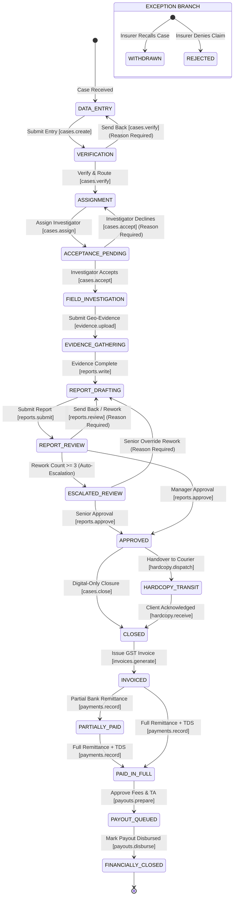

# Case Lifecycle & Status Machine Specification

## 1. Architectural Principle: Status vs Outcome Separation

In the legacy application, investigation findings (Genuine, Fraud, Suspicious, Repudiated) were frequently conflated with workflow closure, leading to broken data entry and premature billing.

In Vericlaim:
1. **Case Status (`cases.status`)**: Represents where the case sits in the operational and financial pipeline (e.g. `DATA_ENTRY`, `ASSIGNED`, `UNDER_INVESTIGATION`, `REPORT_REVIEW`, `APPROVED`, `BILLED`, `FINANCIALLY_CLOSED`).
2. **Investigation Outcome (`cases.outcome`)**: Represents the substantive factual conclusion of the fraud investigation (`PENDING`, `GENUINE`, `FRAUD`, `SUSPICIOUS`, `REPUDIATED`, `UNTRACEABLE`). An outcome can be recorded or amended during investigation or report review without altering the case's physical or billing state.
3. **Exception Lifecycle (`cases.exception_type`)**: Dedicated track for administrative anomalies (`WITHDRAWN`, `REJECTED`) that override normal billing and payout rules.

---

## 2. Mermaid Workflow State Machine

---

## 3. Transition Matrix

| Current Status | Target Status | Required Permission | Reason Required? | Actor / Role | Automatic Side Effects & Validations |
|---|---|---|---|---|---|
| `*` | `DATA_ENTRY` | `cases.create` | No | Data Entry, Back Office | Initializes `doc_code`, sets `status = 'DATA_ENTRY'`, logs `case_status_history`. Data entry can edit all fields. |
| `DATA_ENTRY` | `VERIFICATION` | `cases.create` | No | Data Entry | Validates mandatory fields (`claim_no`, `policy_no`, `insured_name`, `client_id`, `case_type_id`). |
| `VERIFICATION` | `DATA_ENTRY` | `cases.verify` | **Yes (Mandatory)** | Case Manager, Back Office | Send-back for incorrect claim data. Unlocks fields for Data Entry author. |
| `VERIFICATION` | `ASSIGNMENT` | `cases.verify` | No | Case Manager, Admin | Case data frozen. Evaluates `manager_scopes` to lock `owner_manager_id`. If unrouted, alerts `ALL`-scope managers. |
| `ASSIGNMENT` | `ACCEPTANCE_PENDING` | `cases.assign` | No | Owner Manager, Admin | Inserts row into `case_investigators`. Computes agreed fee based on `investigator_payment_terms`. Sends notification to mobile PWA. |
| `ACCEPTANCE_PENDING`| `ASSIGNMENT` | `cases.accept` | **Yes (Mandatory)** | Field Investigator | Investigator declines assignment (e.g. outside territory, capacity limit). Clears slot, returns case to assignment pool. |
| `ACCEPTANCE_PENDING`| `FIELD_INVESTIGATION`| `cases.accept` | No | Field Investigator | Investigator accepts case via mobile PWA. Starts SLA timer tracking field acceptance. |
| `FIELD_INVESTIGATION`| `EVIDENCE_GATHERING` | `evidence.upload` | No | Field Investigator | Uploads geo-tagged photos/videos directly to Cloudflare R2 via presigned URLs. Verifies SHA-256 and magic bytes. |
| `EVIDENCE_GATHERING`| `REPORT_DRAFTING` | `reports.write` | No | Field Investigator, Report Author | Compiles findings into `report_versions` draft. Pre-fills client template based on `case_type`. |
| `REPORT_DRAFTING` | `REPORT_REVIEW` | `reports.submit` | No | Author, Field Investigator | Author sets substantive `outcome` (`GENUINE`, `FRAUD`...). Freezes draft version $V$, locks report for reviewer. |
| `REPORT_REVIEW` | `REPORT_DRAFTING` | `reports.review` | **Yes (Mandatory)** | Reviewer, Case Manager | Increments `cases.rework_count`. Inserts reason into review notes. If `rework_count < 3`, notifies author to edit draft version $V+1$. |
| `REPORT_REVIEW` | `ESCALATED_REVIEW` | System Trigger | No | System | Triggered automatically when `cases.rework_count >= 3`. Moves case to Executive Escalation queue. |
| `ESCALATED_REVIEW` | `REPORT_DRAFTING` | `reports.escalate` | **Yes (Mandatory)** | Agency Owner, Admin | Admin override permitting an additional rework cycle after conference with reviewer and author. |
| `REPORT_REVIEW` | `APPROVED` | `reports.approve` | No | Case Manager, Approver | Generates signed final PDF on server, computes SHA-256, stores in Cloudflare R2. Case cannot be edited without formal amendment. |
| `ESCALATED_REVIEW` | `APPROVED` | `reports.approve` | **Yes (Audit note)** | Agency Owner, Admin | Executive approval overriding prior rework rejections. |
| `APPROVED` | `HARDCOPY_TRANSIT` | `hardcopy.dispatch`| No | Dispatch Clerk, Back Office | Groups cases into `courier_dockets`. Generates Courier Manifest PDF with AWB tracking number. |
| `APPROVED` | `CLOSED` | `cases.close` | No | Case Manager, Admin | Digital-only closure (when physical hardcopy is waived by client agreement). Sets `completed_at = now()`. |
| `HARDCOPY_TRANSIT` | `CLOSED` | `hardcopy.receive` | No | Back Office, Admin | Records proof of delivery from courier tracking. Sets `completed_at = now()`. Case is now eligible for billing. |
| `CLOSED` | `INVOICED` | `invoices.generate`| No | Accountant, Admin | Allocates sequential gapless FY invoice number (inside transaction). Locks case into `invoice_items`. Generates GST invoice PDF. |
| `INVOICED` | `PARTIALLY_PAID` | `payments.record` | No | Accountant | Records bank credit and client TDS deduction. Sets status to partially paid if `balanceDue > 0`. |
| `INVOICED` / `PARTIALLY_PAID` | `PAID_IN_FULL` | `payments.record` | No | Accountant | Records final remittance. When `balanceDue = 0`, case moves to `PAID_IN_FULL`. Eligible for investigator payout settlement. |
| `PAID_IN_FULL` | `PAYOUT_QUEUED` | `payouts.prepare` | No | Accountant | Verifies investigator status, validates outstation TA claims, stages cases into monthly payout settlement run. |
| `PAYOUT_QUEUED` | `FINANCIALLY_CLOSED`| `payouts.disburse` | **Yes (Bank Ref)** | Accountant, Owner | Generates bulk NEFT/RTGS Excel sheet for bank. Marks `payout_status = 'PAID'` and records reference number. Complete financial closure. |

---

## 4. Controlled Send-Back & Escalation Protocol

### 4.1 Unlimited Rework with Audit Accountability
- An investigation agency must ensure report quality for insurance repudiation legal scrutiny.
- Send-backs are **unlimited in quantity**, but strictly controlled:
  - Every send-back requires a non-empty `rework_reason` category and detailed narrative.
  - Every send-back creates a permanent immutable record in `case_status_history` and `report_versions`.
  - The author cannot delete past versions; each rework creates version $V+1$.

### 4.2 Auto-Escalation Threshold ($N = 3$)
- When a case suffers **3 send-backs** (`rework_count >= 3`), it represents either an uncooperative field operative, an ambiguous case, or reviewer pedantry.
- **Escalation Rules:**
  1. Status shifts automatically to `ESCALATED_REVIEW`.
  2. The case is hidden from standard reviewer queues and appears on the **Executive Escalation Queue**.
  3. Only users with `reports.escalate` permission (Owner, Admin) can act:
     - **Option A:** Approve the report directly with executive notes.
     - **Option B:** Reassign the case to a senior field investigator for secondary visit.
     - **Option C:** Authorize an additional rework cycle with specific written guidance.

---

## 5. Exception Lifecycle: Withdrawn & Rejected Cases

### 5.1 Case Withdrawal (`exception_type = 'WITHDRAWN'`)
- **Trigger:** Insurer cancels assignment (e.g. claimant admitted genuine mistake, hospital cancelled cashless claim).
- **Permissions:** Restricted to `cases.withdraw` (Owner, Admin, Case Manager).
- **Mandatory Inputs:** `withdrawal_reason`, insurer confirmation reference.
- **Financial Rule:**
  - Case fee payable to investigator is zeroed by default: `case_investigators.agreed_fee = 0.00`.
  - Outstation travel allowances (TA) already incurred are **not automatically wiped**; manager can approve legitimate fuel/travel expense via `investigator_expenses`.
  - Billed invoice amount is set to 0.00 (Zero-Billing). If already invoiced, forces issuance of a **GST Credit Note**.

### 5.2 Case Rejection (`exception_type = 'REJECTED'`)
- **Trigger:** Insurer refuses to pay agency investigation fee (e.g. delayed submission beyond SLA, deficient enquiry).
- **Permissions:** Restricted to `cases.reject` (Accountant, Admin).
- **Financial Rule:**
  - Case remains billable in the Recovery Hub under `rejected` category for dispute resolution.
  - Investigator payout is placed on legal hold pending management review.
